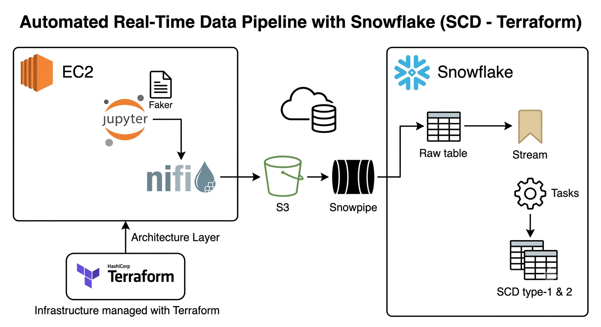

# SCD Data Warehousing with Snowflake

A near real-time data pipeline that captures customer changes via Apache
NiFi, stages them in Amazon S3, and applies Slowly Changing Dimensions
(SCD Type 1 & Type 2) in Snowflake using Streams, Tasks, and Snowpipe.

## Table of Contents

1. [Architecture](#architecture)
2. [Tech Stack](#tech-stack)
3. [Repository Layout](#repository-layout)
4. [Prerequisites](#prerequisites)
5. [Setup & Deployment](#setup--deployment)
6. [Pipeline Walkthrough](#pipeline-walkthrough)
7. [SCD Concepts](#scd-concepts)
8. [Operating the Pipeline](#operating-the-pipeline)
9. [Troubleshooting](#troubleshooting)
10. [Cleanup](#cleanup)

## Architecture



### Data flow

```
Faker (Python)  ->  Local folder on EC2  ->  Apache NiFi  ->  Amazon S3
                                                                  |
                                                          (auto-ingest)
                                                                  v
                                  customer_raw  <--  Snowpipe  --+
                                       |
                                  MERGE (Task: tsk_scd_raw, every 1 min)
                                       v
                                   customer  ----  Stream: customer_table_changes
                                                          |
                                                  MERGE (Task: tsk_scd_hist, every 1 min)
                                                          v
                                                  customer_history (SCD Type 2)
```

## Tech Stack

| Layer             | Technology                               |
|--------------------|-------------------------------------------|
| Languages           | Python 3, SQL                             |
| Data generation     | `faker` (Python)                          |
| Orchestration       | Apache NiFi 1.14, Snowflake Tasks         |
| Compute             | Amazon EC2 (Amazon Linux 2, `t2.large`)   |
| Storage             | Amazon S3                                 |
| Data warehouse      | Snowflake (Snowpipe, Streams, Tasks)      |
| Containerization    | Docker, Docker Compose                    |
| IaC                 | Terraform (AWS provider `~> 6.0`)         |

## Repository Layout

```
.
├── README.md
├── faker.ipynb                  # Customer data generator (Python + Faker)
├── convention.txt               # Quick command reference
├── note.txt                     # NiFi image fallback versions
├── architecture.jpg
├── .gitignore
│
├── sqls/                        # Snowflake SQL, run in numeric order
│   ├── 01 table_creation.sql    #   warehouse, database, raw table
│   ├── 02 data_ingestion.sql    #   storage integration, stage, Snowpipe
│   ├── 03 scd_type-1.sql        #   customer table + tsk_scd_raw task
│   └── 04 scd_type-2.sql        #   stream, customer_history, tsk_scd_hist
│
├── docker_exp/
│   └── docker-compose.yml       # JupyterLab + Apache NiFi
│
├── terraform/
│   ├── providers.tf             # AWS provider, region: us-west-2
│   ├── main.tf                  # S3 bucket, security group, key-pair, EC2
│   └── outputs.tf               # public IP, bucket name, SSH command
│
└── notes/
    ├── commands.sh               # EC2 setup + Docker bring-up
    ├── ec2connect.bat             # Windows SSH helper
    ├── portforwarding.bat         # Windows SSH tunnel helper
    └── images/                    # Architecture diagrams
```

## Prerequisites

- AWS account with permissions for EC2, S3, and IAM
- A Snowflake account with a role that can create warehouses, databases,
  storage integrations, and tasks
- Local Terraform >= 1.5, AWS CLI v2 (configured via `aws configure`),
  and an SSH client
- Docker / Docker Compose are installed on the EC2 host by
  `notes/commands.sh` - not required locally

## Setup & Deployment

### 1. Provision AWS infrastructure

```
cd terraform
terraform init
terraform plan
terraform apply
```

This creates a VPC-default security group, an SSH key-pair, an S3 bucket,
and a `t2.large` EC2 instance running Amazon Linux 2. Outputs include the
instance's public IP, the S3 bucket name, and a ready-to-use SSH command.

### 2. Connect to EC2 and bootstrap Docker

```
ssh -i ~/.ssh/scd-key ec2-user@<EC2_PUBLIC_IP>
```

On the instance:

```
sudo yum update -y
sudo amazon-linux-extras install docker -y
sudo service docker start
sudo systemctl enable docker
sudo usermod -a -G docker ec2-user

sudo curl -SL https://github.com/docker/compose/releases/latest/download/docker-compose-linux-x86_64 \
    -o /usr/local/bin/docker-compose
sudo chmod +x /usr/local/bin/docker-compose
```

Copy `docker_exp/docker-compose.yml` to the instance and bring up the
stack:

```
scp -i ~/.ssh/scd-key docker_exp/docker-compose.yml ec2-user@<EC2_PUBLIC_IP>:~/
ssh -i ~/.ssh/scd-key ec2-user@<EC2_PUBLIC_IP> "docker-compose up -d"
```

### 3. Tunnel to NiFi and JupyterLab

The security group only opens SSH (22), so both UIs are reached through
an SSH tunnel rather than public ports:

```
ssh -i ~/.ssh/scd-key -L 8443:localhost:8443 -L 8888:localhost:8888 ec2-user@<EC2_PUBLIC_IP>
```

- NiFi: `https://localhost:8443/nifi`
- JupyterLab: `http://localhost:8888`

### 4. Generate sample data

Run `faker.ipynb` in JupyterLab. Each run writes 10 customer records
(mixing new and existing IDs, to simulate updates) to a shared folder
that both the JupyterLab and NiFi containers mount.

### 5. Build the NiFi flow

Two processors, connected on the `success` relationship:

- **GetFile** - watches the shared folder for new CSVs
- **PutS3Object** - uploads each file to the S3 bucket, using
  `${filename}` as the object key

`success` and `failure` are set to auto-terminate since nothing
downstream needs the flowfile after upload.

### 6. Configure Snowflake

Run the SQL files in order, in a Snowflake worksheet:

```sql
-- 1. Warehouse, database, schemas, raw table
-- sqls/01 table_creation.sql

-- 2. Storage integration, IAM trust role, stage, Snowpipe
-- sqls/02 data_ingestion.sql

-- 3. SCD Type 1: customer table + tsk_scd_raw task
-- sqls/03 scd_type-1.sql

-- 4. SCD Type 2: stream, customer_history, tsk_scd_hist task
-- sqls/04 scd_type-2.sql
```

**Storage Integration**: Snowflake authenticates to S3 through an AWS IAM
role rather than static keys. After creating the integration, run
`DESC INTEGRATION scd_s3_integration` and use the returned
`STORAGE_AWS_IAM_USER_ARN` / `STORAGE_AWS_EXTERNAL_ID` to build the IAM
role's trust policy.

### 7. Wire Snowpipe to S3 events

After creating the pipe, run `SHOW PIPES` and copy the
`notification_channel` (an SQS ARN). Add it as an S3 **event
notification** (all object create events) on the bucket so new files
trigger Snowpipe automatically.

## Pipeline Walkthrough

| Stage           | Component                          | What happens                                                    |
|-------------------|--------------------------------------|--------------------------------------------------------------------|
| Generation        | `faker.ipynb` on EC2                 | Writes timestamped CSVs to a shared folder                         |
| Movement           | NiFi `GetFile` -> `PutS3Object`      | Pushes new files to S3                                              |
| Ingestion          | Snowpipe (`customer_pipe`)           | Auto-loads CSVs into `customer_raw`                                 |
| SCD Type 1         | Task `tsk_scd_raw` (1 min)           | MERGEs the latest row per customer into `customer`                  |
| Change capture     | Stream `customer_table_changes`      | Tracks inserts/updates on `customer`                                 |
| SCD Type 2         | Task `tsk_scd_hist` (1 min)          | Closes the previous "current" row and inserts the new version       |

## SCD Concepts

| Type   | Behaviour                                              | Implemented?         |
|---------|-----------------------------------------------------------|-------------------------|
| Type 1  | Overwrite - no history retained                            | Yes - `customer`       |
| Type 2  | Full history via `start_date`, `end_date`, `is_current`    | Yes - `customer_history` |

`customer_history` exposes the active row via `is_current = TRUE`;
superseded rows carry the timestamp at which a newer version replaced
them in `end_date`.

## Operating the Pipeline

```sql
-- Confirm both tasks are scheduled and running
SHOW TASKS;

-- Pause / resume a task
ALTER TASK tsk_scd_raw  SUSPEND;
ALTER TASK tsk_scd_raw  RESUME;

-- Inspect the change stream
SELECT * FROM customer_table_changes;

-- Find customers with more than one historical version
SELECT customer_id, COUNT(*) AS versions
FROM customer_history
GROUP BY customer_id
HAVING COUNT(*) > 1;
```

## Troubleshooting

Issues actually hit while building this pipeline:

| Symptom                                                    | Cause / Fix                                                                                                 |
|--------------------------------------------------------------|-----------------------------------------------------------------------------------------------------------------|
| `GetFile` re-reads the same file thousands of times            | `Keep Source File` was `true` with `Polling Interval = 0s`. Set `Keep Source File = false`.                       |
| `GetFile` reports "Directory does not exist"                    | The NiFi container's mounted path did not match the host folder used in `docker-compose.yml`. Align both paths. |
| `customer_history` stays empty even though the task "SUCCEEDED"  | The task read the Stream twice (once per statement), and the second read got nothing. Materialise the stream into a temporary table first, then reuse it for both the `UPDATE` and `INSERT`. |
| `Warehouse cannot be resumed` - resource monitor quota exceeded  | A Snowflake resource monitor hit its daily credit limit. Detach it (`ALTER WAREHOUSE ... SET RESOURCE_MONITOR = NULL`) or raise the quota. |
| `Number of columns in file does not match table`                  | The raw table has an extra `loaded_at` column with a default value. Explicitly list the target columns in `COPY INTO`. |
| Cannot reach NiFi/JupyterLab in the browser                        | The SSH tunnel dropped or the EC2 instance was stopped/restarted (new public IP). Re-open the tunnel with the current IP. |

## Cleanup

```sql
-- Snowflake: stop the tasks (warehouses auto-suspend after 60s idle)
ALTER TASK tsk_scd_hist SUSPEND;
ALTER TASK tsk_scd_raw  SUSPEND;
```

```
# AWS: stop the instance to pause compute billing, or destroy everything
cd terraform
terraform destroy
```

`terraform destroy` removes the EC2 instance, S3 bucket, security group,
and key-pair. Empty the S3 bucket first if it still holds objects.

## Key Takeaways

- End-to-end CDC on Snowflake using Streams + Tasks, no third-party CDC
  tooling required.
- A reproducible AWS environment (EC2 + S3) provisioned entirely from
  Terraform.
- Containerised NiFi + JupyterLab via Docker Compose for fast bring-up
  and tear-down.
- Clear separation of concerns: SCD Type 1 logic lives in
  `03 scd_type-1.sql`, Type 2 in `04 scd_type-2.sql`.
